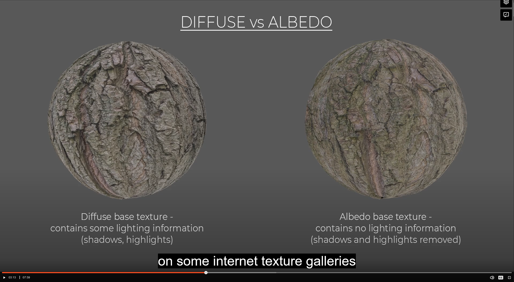

# DEV-01, Getting Started
### Tags: [texture maps]
### Link:[<https://academy.cgboost.com/courses/substance-painter-launch-pad/lectures/13086422>]

## Getting started with Substance Painter

    Some Commands:
    Alt + LMB | Rotate camera in the 3D view
    Shift + RMB | Rotate the scene's lighting (HDR map) 

### What are texture Maps

    All the lighting effects that you see on the mesh are the result of a number of texture maps working together

    Texture Maps are square images covering the surface of your 3d model with colors and other information.
    They are dependent on your UV maps.

    UV Maps are usually prepared in Blender

### Important texture maps

    You can use any number of various texture maps plugged into your model but there are several which are used most often.

#### [Base Color] Defines the color of your surface

    This can come in several other terms like Diffuse, Color Map. But most importantly Albedo is the name. only color, devoid of all else.
    The reason to remove these highlights and shadows is to be able to light your material properly in 3D software without any lighting information
    being already present in the texture

#### [Roughness] Defines how uneven the surface is

    Anywhere that is black, the surface is flat, where there is white and levels of gray, the surface is uneven

#### [Metalness] Defines how metallic the surface is

    Anywhere that is black, the surface is dielectric, where there is white and levels of gray, the surface is metallic

#### [Height] Defines how the surface will be bumped

    Anywhere that is white will be pushed up in the geometry, anything black will go below.
    unfortunately, its not that performant. Normal is a less taxing solution (bump map is black and white, normal mapping includes blue and red)

#### [Normal+Height+Mesh]

