# DEV-02, Baked Mesh Maps
### Tags: [texture maps]
### Link:[<https://academy.cgboost.com/courses/substance-painter-launch-pad/lectures/13086974>]

## Mesh Maps
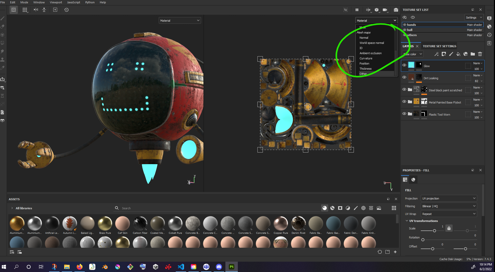

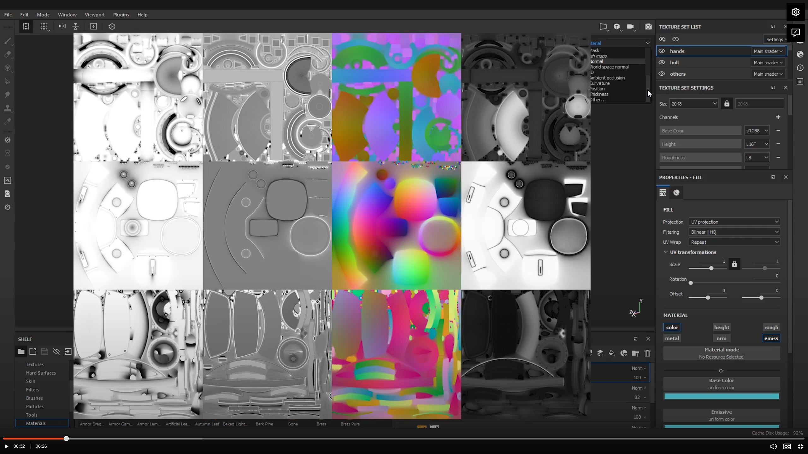

    These are slightly different from the texture maps already introduced. In substance painter we create these through a process called baking.
    Basically you add your mesh into your project, and usually the first thing you do is bake these textures. Substance painte actually needs them
    to do its various computations based operations

    Here are these textures

#### Normal
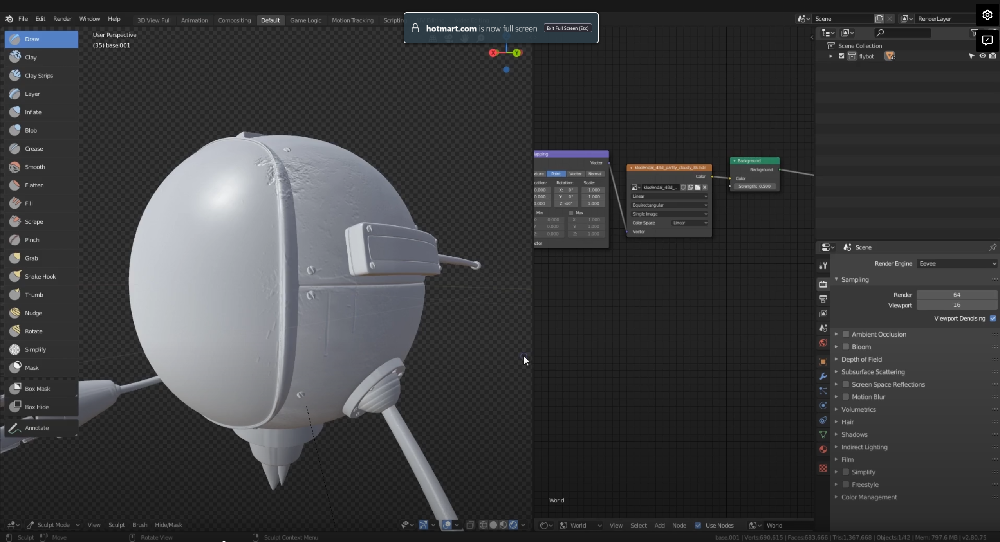

    Often you would take the base model you created in Blender, sculpt it and create all sorts of surface details and 
    create this high res version of your mesh

    Then you would take it, load both your low res and hi res mesh and let the software bake all your hi res details into your low poly mesh.

#### World Space Normal
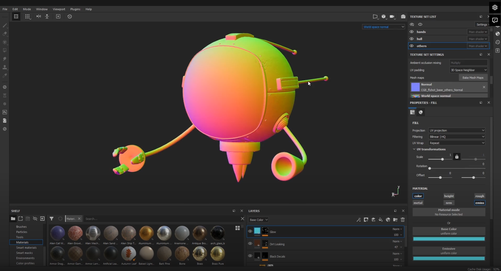

    This indicates where is up, down, right, left. generated by substance painter

## ID Map
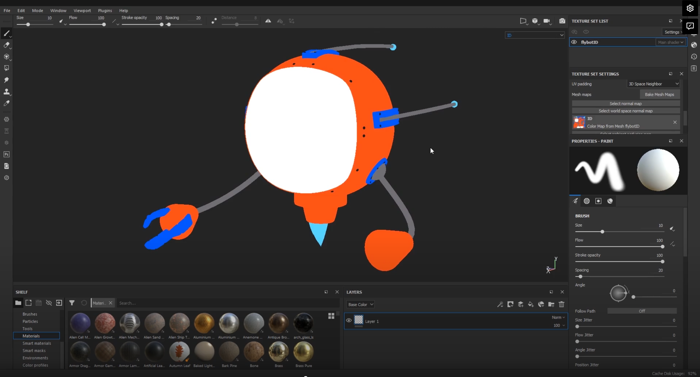
    
    In blender you can vertex paint a bunch of pieces of your mesh

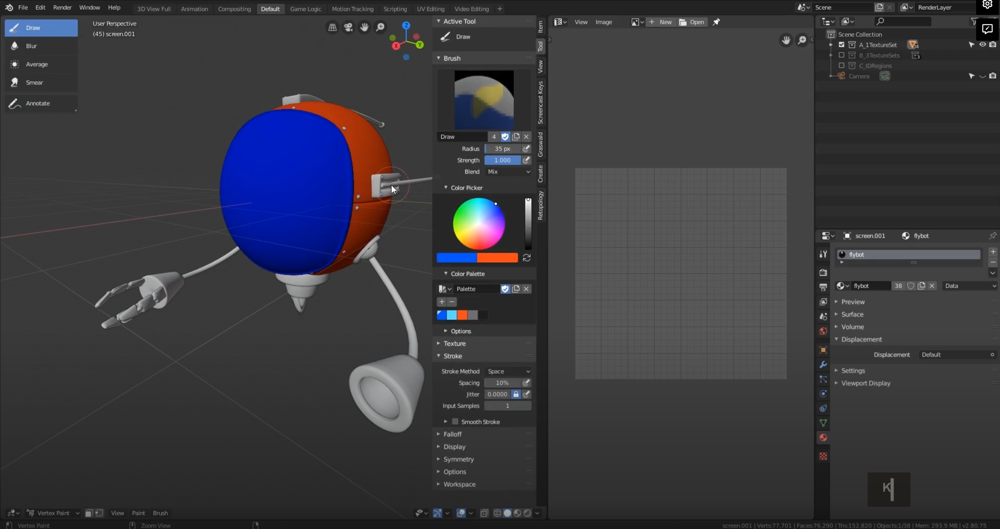

    You can then export it with vertex color

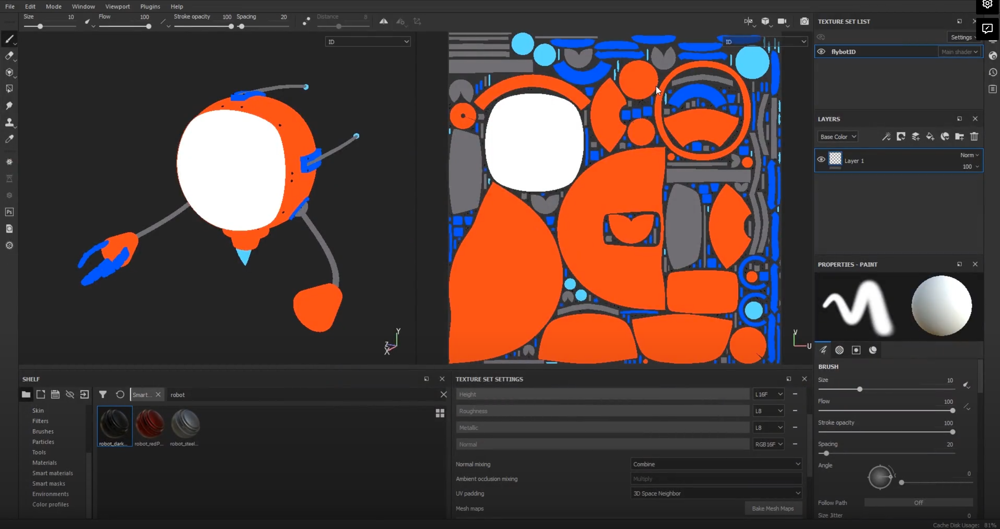

#### Ambient Occlusion Map
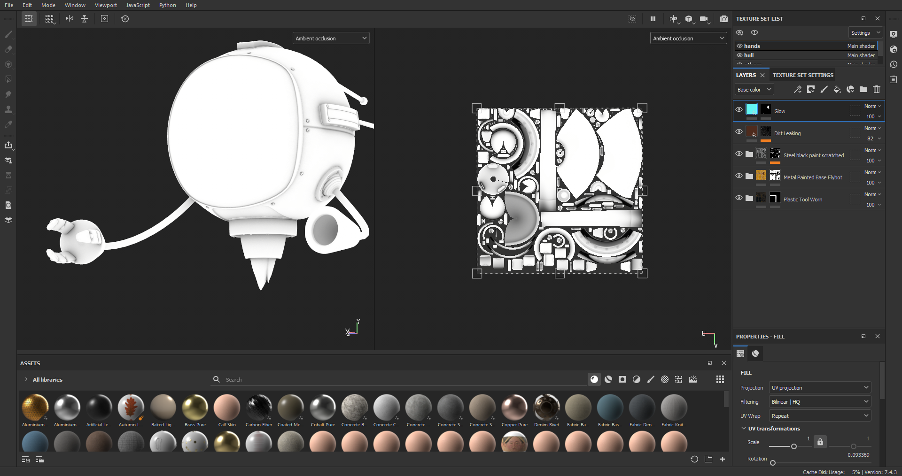

    You can see that whenever you have two objects coming close to each other, they throw a soft dark color next to eachother.
    This is useful for adding details like dirt. It is not lighting informating.

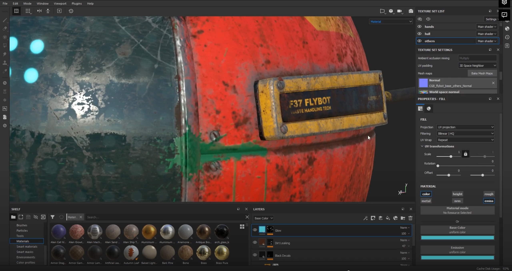

#### Curvature
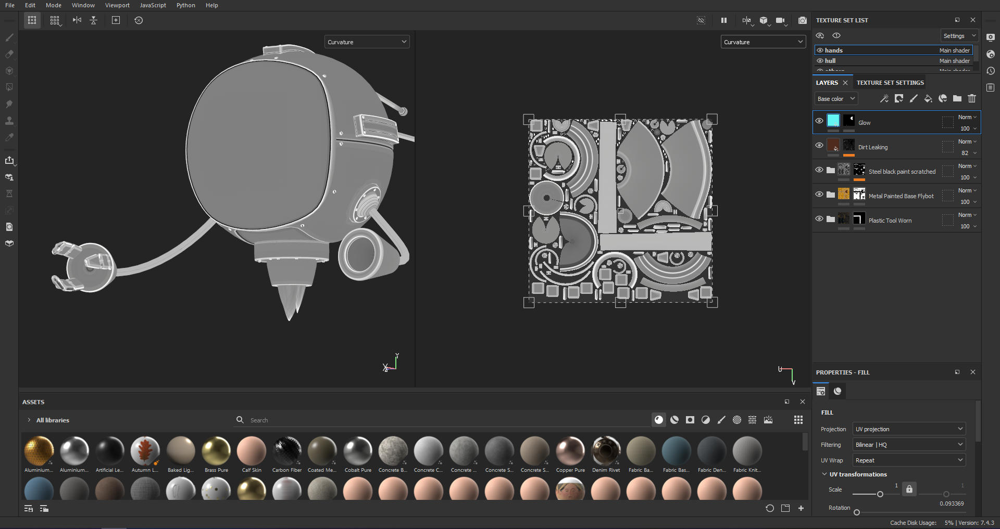

    Indicates how curved your surface is. Black OR White the surface is the more curve changes going on.
    White is concave (indentions), Black is convex (peaks)

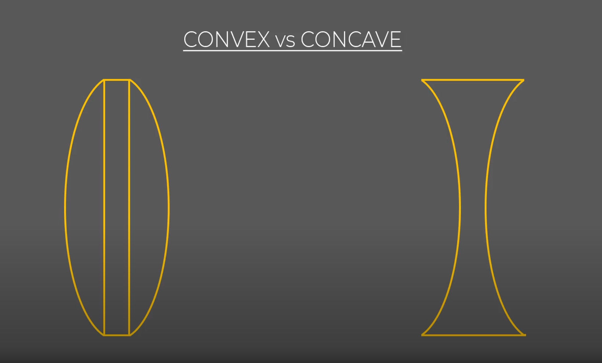

#### Thickness
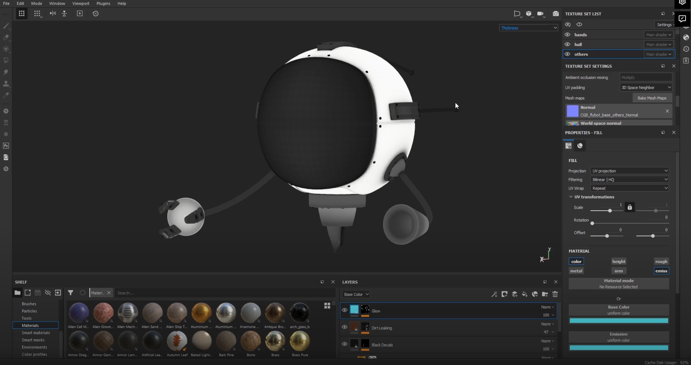

    If your model has two sides and some thickness to it, substance painter finds that out and bakes the information.
    White where it is thick and black where it isnt. useful for organic stuff like human skin, leaves when light pass through or so
