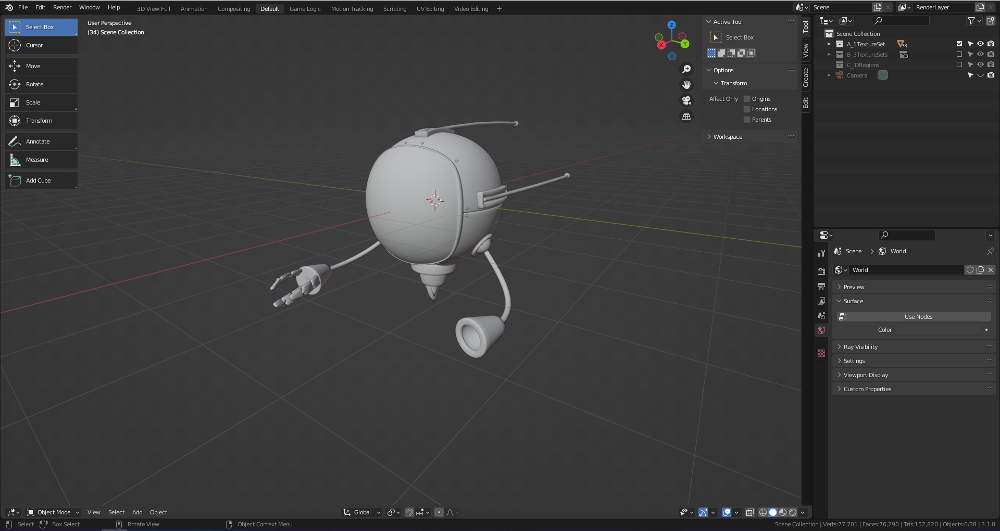
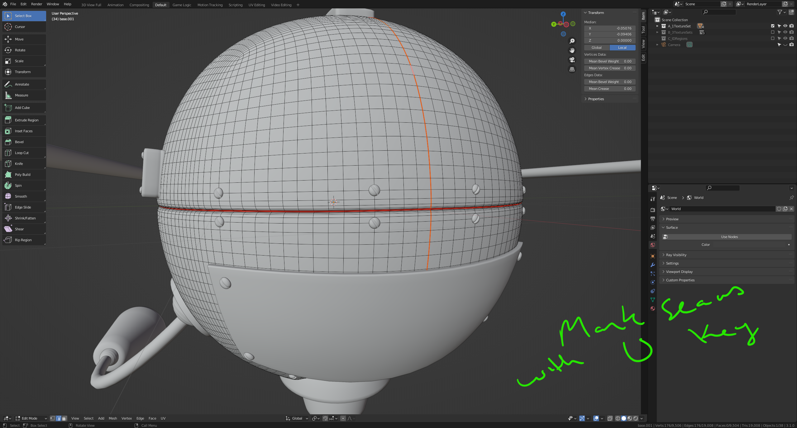
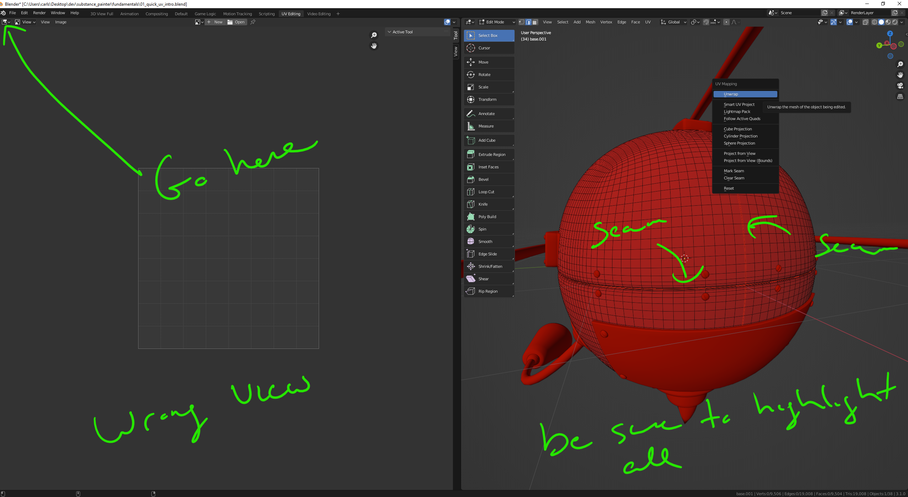
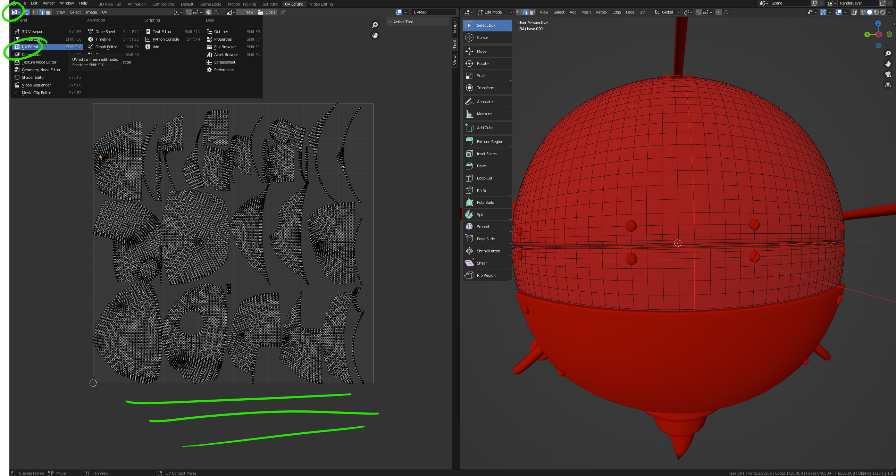
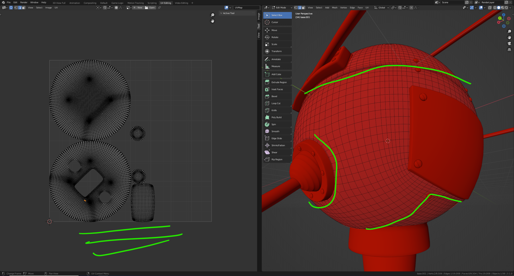
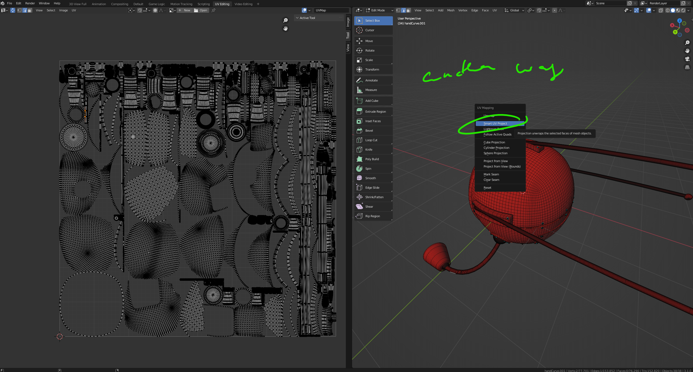

# DEV-03, Quick UV Mapping Intro
### Tags: [UVs]
### Link:[<https://academy.cgboost.com/courses/substance-painter-launch-pad/lectures/13064357>]

## Preparing your model

    UVs are basically a way of flattening your 3D model in a 2d space so that you are able to paint and add texture onto them

    If you put you seams in logical places it can prduce nice looking UV maps

    Using Smart UV Project on the whole model

