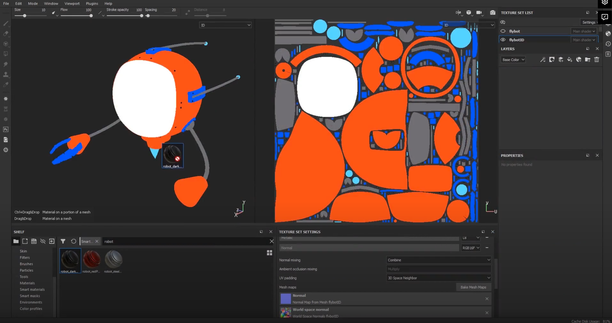

# DEV-04, Three ways to export your 3d Model
### Tags: [exporting]
### Link:[<https://academy.cgboost.com/courses/substance-painter-launch-pad/lectures/13065156>]

## UV Set (1 texture Set)

    
    The goal of this UV region is to fill it as densely as possible.
    But at the some time we dont have to fit ALL our UV pieces into one UV plane.
    You can have several UV sets

## UV Set (3 texture Sets)

    This honestly is miles better and easier to draw directly on in my opinion

## IDs

    You can basically bake a simple color information into your model. and assign materials quickly

