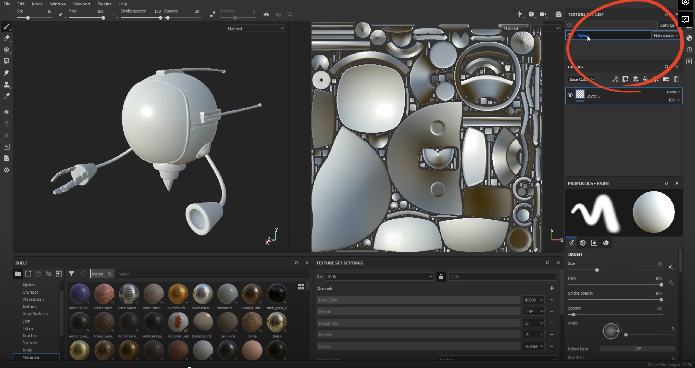
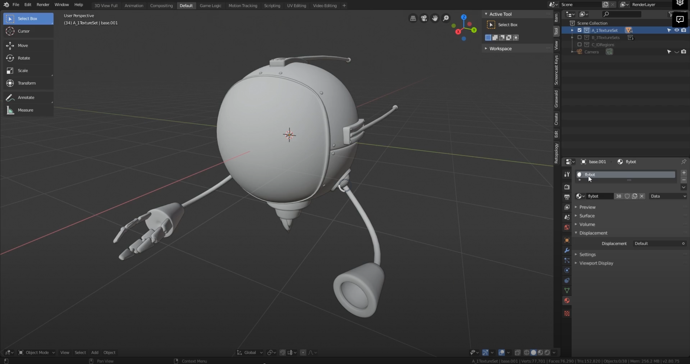

# DEV-05, Single Texture Set
### Tags: [texture Sets]
### Link:[<https://academy.cgboost.com/courses/substance-painter-launch-pad/lectures/13086050>]

## Materials

    Any material you create in blender will be exported into Substance Painter as a separate texture set.
    Materials in Blender equals texture sets in Substance Painter.

    SUbstance Painter by default does not take into accound how many UV sets you've laid out in Blender.
    The only thing that decides how many texture sets appear here is in this window is how many materials you model
    contains.

