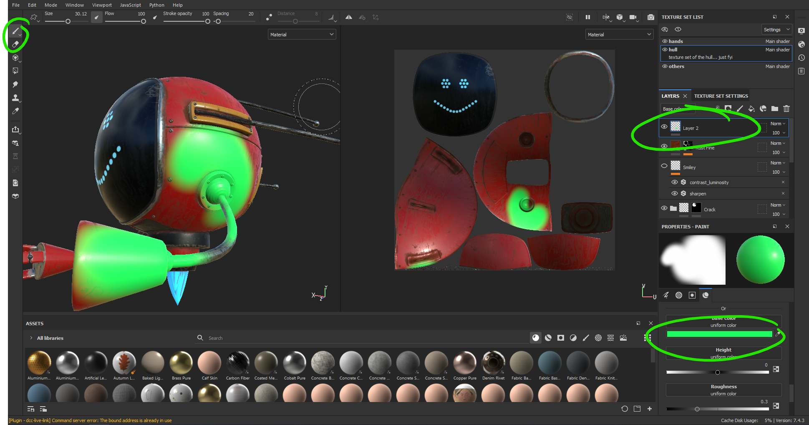

# DEV-08, Identifying some tools
### Tags: []
### Link:[<https://academy.cgboost.com/courses/substance-painter-launch-pad/lectures/13091444>]

## 

    Ctrl + RMB + drag to sides | Change the size of your brush

    Ctrl + RMB + drag up/down | Change the hardness of your brush

    Ctrl + LMB + drag up/down | Rotate your brush
    
    Ctrl + LMB + drag to sides | Change the flow of your brush

## Topic B

## Topic C

## Topic D

## Topic E

