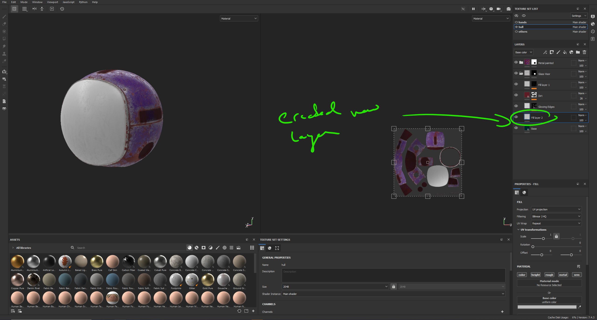
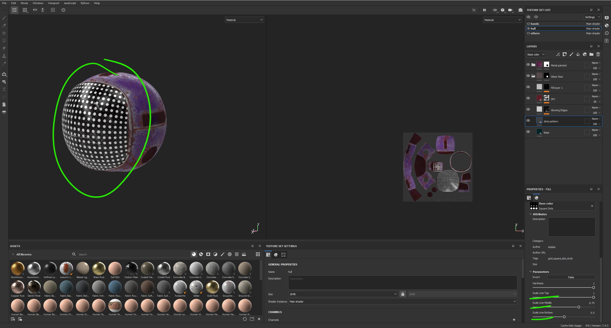
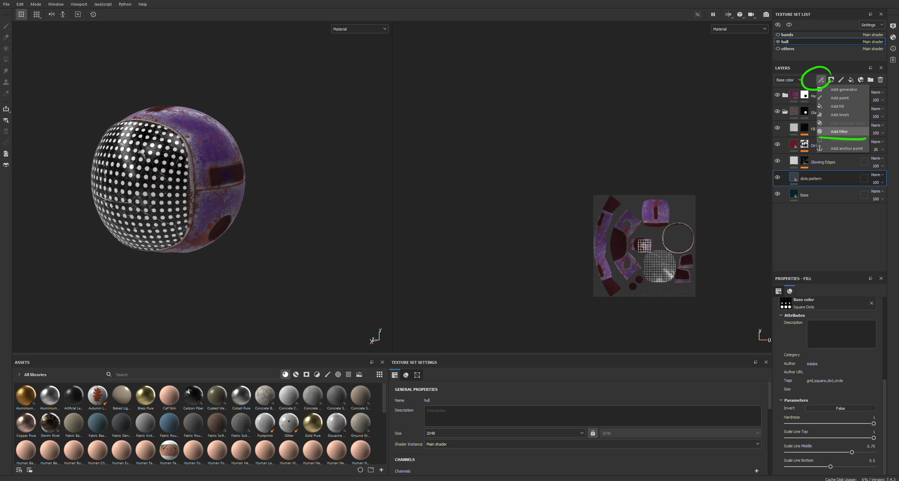
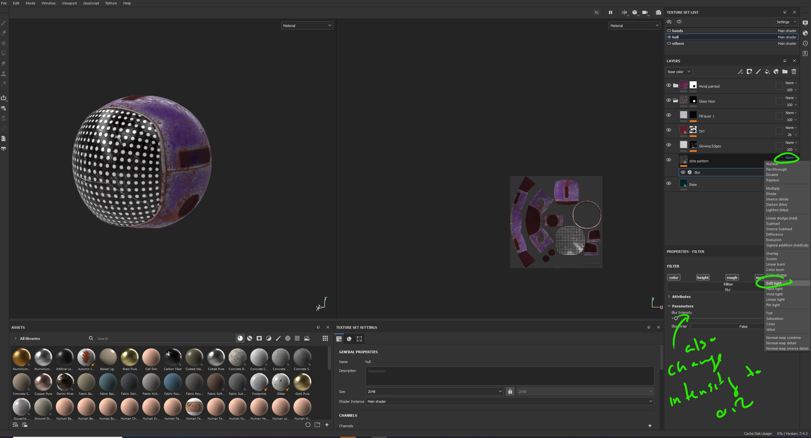
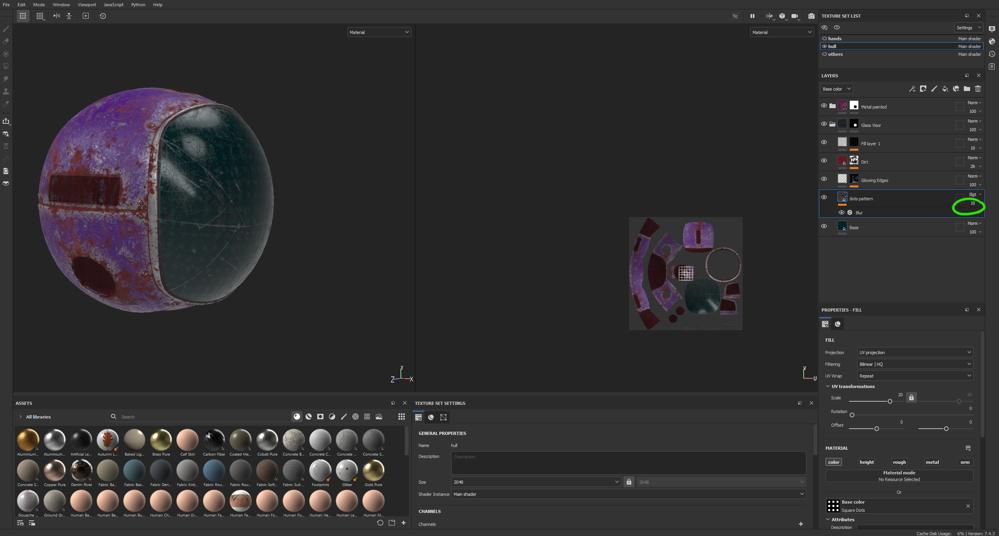
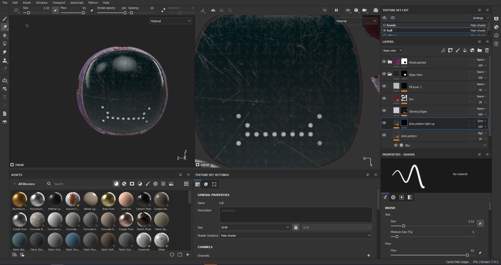
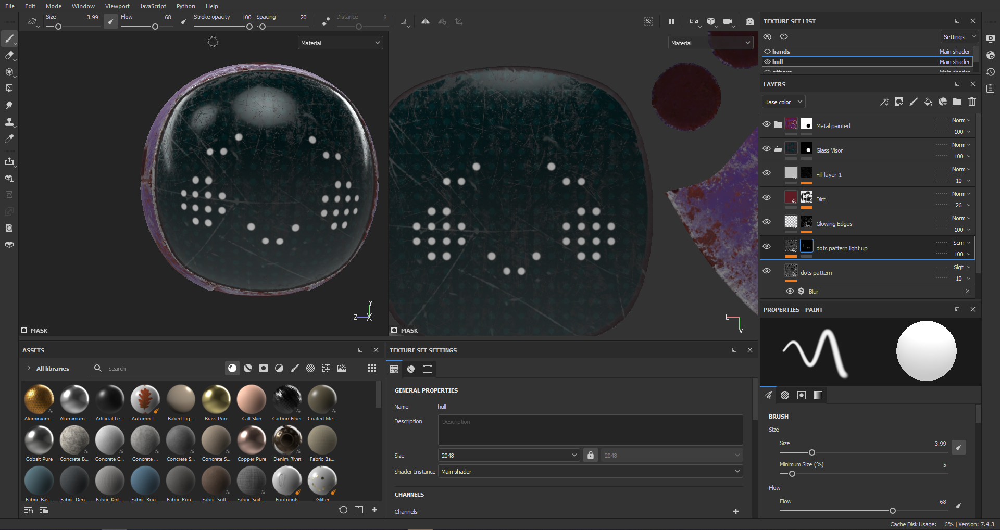
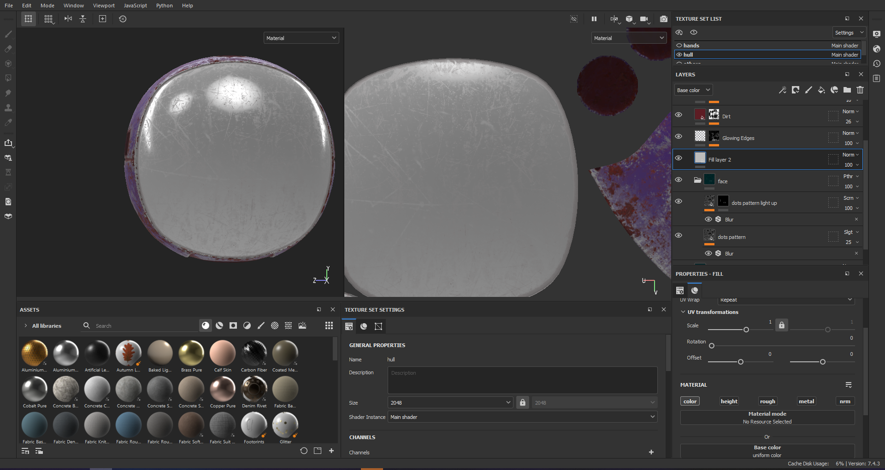
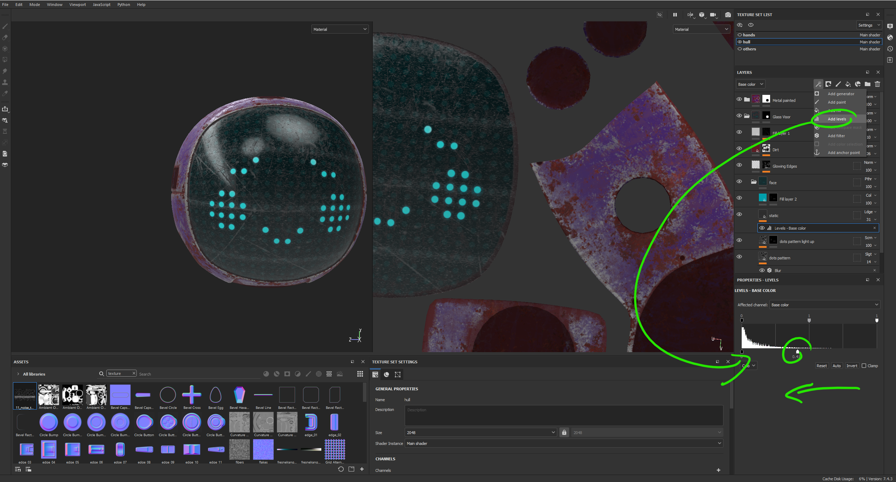
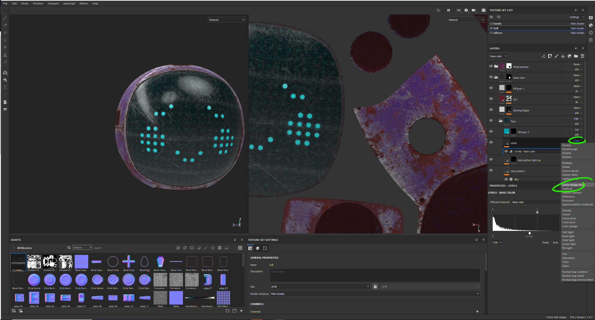

# DEV-15, Adding a Face
### Tags: []
### Link:[<https://academy.cgboost.com/courses/substance-painter-launch-pad/lectures/13134286>]

## Add Generated texture for dots

## Apply color and blur for the screen

## Topic Apply face design

## Add static by importing texture

